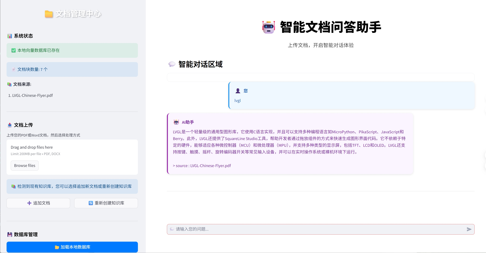

# 智能文档问答助手

**项目掘金链接**: [本地文档AI助手：基于LangChain和Qwen2.5的智能问答系统](https://juejin.cn/post/7516571684255399936)

基于 LangChain 和 Streamlit 构建的智能文档问答系统，支持 PDF 和 Word 文档的上传、处理和智能问答。



## 项目结构

```
local-doc-ai/
├── main.py                    # 主应用入口，包含界面逻辑
├── config.py                  # 应用配置管理模块
├── config.yaml                # 应用配置文件 (用户可修改)
├── styles.py                  # 样式配置模块
├── document_processor.py      # 文档处理模块
├── conversation_handler.py    # 对话处理模块
├── local_embeddings.py        # 本地嵌入模型包装器
├── qwen_llm.py               # Qwen 大语言模型实现
├── requirements.txt          # 项目依赖配置
├── .gitignore               # Git 忽略文件配置
├── readme.md                # 项目说明文档
└── resource/                # 示例文档资源
    ├── LVGL-Chinese-Flyer.pdf
    ├── chatgpt.pdf
    ├── knowledge.txt
    └── news.docx
```

## 模块说明

### 1. main.py - 主应用模块
- 应用程序的主入口
- 页面配置和布局
- 侧边栏功能
- 用户交互处理

### 2. styles.py - 样式配置模块
- CSS样式定义
- 消息模板
- 界面美化

### 3. document_processor.py - 文档处理模块
- PDF文档文本提取
- Word文档文本提取
- 文本分割处理
- 向量数据库创建和管理

### 4. conversation_handler.py - 对话处理模块
- 对话链创建
- 用户输入处理
- 聊天历史管理
- AI回答生成

### 5. local_embeddings.py - 本地嵌入模型
- 支持 ModelScope 和 sentence-transformers
- CUDA GPU 加速和内存优化
- 全局模型缓存机制
- 默认使用 gte-Qwen2-1.5B-instruct 模型

### 6. qwen_llm.py - Qwen 大语言模型
- Qwen2.5-1.5B-Instruct 模型实现
- 支持 ModelScope 自动下载
- CUDA 加速和内存管理
- LangChain 兼容接口

### 7. config.py - 配置管理模块
- 定义和管理应用的所有配置项
- 支持从 `config.yaml` 文件加载配置
- 提供默认配置值

## 功能特性

- 📄 **多格式支持**: 支持 PDF 和 Word 文档上传
- 🤖 **智能问答**: 基于文档内容的 AI 智能回答
- 💾 **数据持久化**: 向量数据库本地保存和加载
- 💬 **对话历史**: 完整的聊天记录管理
- 🎨 **现代界面**: 简洁美观的用户界面
- ⚡ **快速检索**: 基于 FAISS 的高效向量检索
- 🔧 **模块化设计**: 代码结构清晰，易于维护和扩展

## 技术栈

- **前端框架**: Streamlit
- **AI 框架**: LangChain + LangChain Community
- **向量数据库**: FAISS (CPU 版本)
- **文档处理**: PyPDF2, python-docx
- **嵌入模型**: gte-Qwen2-1.5B-instruct (ModelScope)
- **语言模型**: Qwen2.5-1.5B-Instruct 
- **深度学习**: PyTorch + Transformers
- **模型管理**: ModelScope + sentence-transformers
- **数据处理**: NumPy, Pydantic
- **配置文件**: PyYAML

## 安装和使用

### 1. 克隆项目
```bash
git clone <repository-url>
cd local-doc-ai
```

### 2. 创建虚拟环境（推荐）

**使用 venv（Python 内置）**：
```bash
# 创建虚拟环境
python -m venv local-doc-ai-env

# 激活虚拟环境
# Windows:
local-doc-ai-env\Scripts\activate
# macOS/Linux:
source local-doc-ai-env/bin/activate
```

**使用 conda**：
```bash
# 创建虚拟环境
conda create -n local-doc-ai python=3.12

# 激活虚拟环境
conda activate local-doc-ai
```

### 3. 安装依赖
```bash
pip install -r requirements.txt
```

### 4. (可选) 配置应用
   在首次运行前，您可以根据需要修改项目根目录下的 `config.yaml` 文件。该文件允许您自定义模型路径、设备选择、向量数据库设置等。

### 5. 运行应用
```bash
streamlit run main.py
```

### 6. 使用步骤
1. 在侧边栏上传 PDF 或 Word 文档
2. 点击"处理新文档"按钮创建向量数据库
3. 在对话区域输入问题开始智能问答
4. 可以管理本地数据库和对话历史

## 项目优势

### 🔒 隐私安全
- **完全本地化**: 所有数据处理在本地完成，无需联网
- **数据保护**: 文档内容不会上传到任何外部服务
- **离线运行**: 模型下载后可完全离线使用

### 🚀 性能优化
- **GPU 加速**: 支持 CUDA 加速，处理速度提升 3-5 倍
- **智能缓存**: 模型和向量数据库缓存机制
- **内存管理**: 自动设备检测和内存优化
- **批量处理**: 支持多文档并行处理

### 🛠️ 技术先进
- **最新模型**: 使用 Qwen2.5-1.5B 和 gte-Qwen2 最新模型
- **模块化架构**: 清晰的代码结构，易于维护和扩展
- **LangChain 集成**: 完整的 RAG 工作流实现
- **多格式支持**: PDF、DOCX、TXT 等多种文档格式

### 💡 用户体验
- **简洁界面**: 基于 Streamlit 的现代化 Web 界面
- **实时反馈**: 处理进度和状态实时显示
- **智能问答**: 基于文档内容的精准回答
- **易于部署**: 一键安装，快速启动

## 开发说明

### 开发环境设置

**1. 虚拟环境管理**
```bash
# 开发时激活虚拟环境
source local-doc-ai-env/bin/activate  # macOS/Linux
local-doc-ai-env\Scripts\activate     # Windows

# 退出虚拟环境
deactivate

# 导出依赖（开发时更新）
pip freeze > requirements.txt
```

**2. 代码结构**
- `main.py`: 主应用入口和 Streamlit 界面
- `styles.py`: CSS 样式和界面美化
- `document_processor.py`: 文档处理和向量化
- `conversation_handler.py`: 对话逻辑和 LLM 交互
- `local_embeddings.py`: 本地嵌入模型管理
- `qwen_llm.py`: Qwen 模型实现
- `config.py`: 应用配置定义
- `config.yaml`: 用户自定义配置

### 添加新功能
1. 在对应模块中添加新函数
2. 在main.py中调用新功能
3. 更新样式配置（如需要）

### 自定义样式
- 修改styles.py中的CSS样式
- 调整消息模板格式
- 更新界面配色方案

### 扩展文档类型
- 在document_processor.py中添加新的文档处理函数
- 更新文件上传组件的类型限制
- 测试新格式的兼容性

## 配置说明

项目使用 `config.yaml` 文件进行详细配置，允许用户根据自己的环境和需求调整应用行为。`config.py` 模块负责加载此配置文件，并提供默认值。

### 主要配置项 (`config.yaml`)

以下是 `config.yaml` 中一些关键的配置选项及其说明：

```yaml
# 设备选择: 'auto', 'cuda', 'cpu'
device: auto

# Qwen 大语言模型配置
qwen_model:
  model_name_or_path: Qwen/Qwen2-1.5B-Instruct  # ModelScope 模型名称或本地路径
  # local_model_path: /path/to/your/local/qwen/model # 如果使用本地模型，请取消注释并指定路径
  # revision: master # 模型版本，通常不需要修改
  # precision: auto # 模型精度: 'auto', 'fp16', 'bf16', 'int4', 'int8'
  # cpu_only: false # 是否强制使用 CPU

# 嵌入模型配置
embedding_model:
  model_name_or_path: ipex-llm/gte-qwen2-1.5b-instruct-embed # ModelScope 模型名称或本地路径
  # local_model_path: /path/to/your/local/embedding/model # 如果使用本地模型，请取消注释并指定路径
  # revision: master # 模型版本
  # precision: auto # 模型精度
  # cpu_only: false # 是否强制使用 CPU
  batch_size: 32      # 嵌入处理的批量大小
  normalize_embeddings: true # 是否归一化嵌入向量

# 向量数据库配置
vector_store:
  db_path: ./vector_store_db # 向量数据库存储路径
  index_name: faiss_index    # FAISS 索引名称

# 聊天历史配置
chat_history:
  max_length: 5 # 保留的最大对话轮数

# 文档处理配置
document_processing:
  chunk_size: 500    # 文本分割的块大小
  chunk_overlap: 50  # 文本分割的重叠大小
  allowed_extensions: ['.pdf', '.docx', '.txt'] # 允许上传的文件扩展名

# 应用界面配置
ui:
  title: "智能文档问答助手 v2.0" # 应用标题
  sidebar_width: 350 # 侧边栏宽度

# 日志配置
logging:
  level: INFO # 日志级别: DEBUG, INFO, WARNING, ERROR, CRITICAL
  format: '%(asctime)s - %(name)s - %(levelname)s - %(message)s'
```

### 如何修改配置

1.  打开项目根目录下的 `config.yaml` 文件。
2.  根据您的需求修改相应的配置值。
3.  保存文件并重新启动应用 (`streamlit run main.py`) 以使更改生效。

**注意**: 
-   如果 `config.yaml` 文件不存在或某些配置项缺失，系统将使用 `config.py` 中定义的默认值。
-   对于模型路径，您可以直接使用 ModelScope 上的模型名称 (如 `Qwen/Qwen2-1.5B-Instruct`)，系统会自动尝试下载。或者，如果您已将模型下载到本地，可以取消注释 `local_model_path` 并指定其绝对路径。

### 本地模型配置

**嵌入模型**：
- 默认：`iic/gte_Qwen2-1.5B-instruct` (ModelScope)
- 自动下载和缓存
- 支持 CUDA GPU 加速

**语言模型**：
- 模型：`Qwen/Qwen2.5-1.5B-Instruct` (ModelScope)
- 自动下载和缓存
- 自动设备检测和内存优化

### 环境要求
- **Python**: 3.8+ (推荐 3.10+)
- **内存**: 至少 8GB RAM (推荐 16GB+)
- **显卡**: NVIDIA GPU (可选，用于加速)
- **磁盘**: 至少 10GB 可用空间
- **网络**: 首次运行需要下载模型

## 注意事项

- **首次运行**: 需要自动下载模型文件 (约 3-5GB)
- **文档处理**: 大文档 (>50页) 可能需要 2-5 分钟处理时间
- **数据管理**: 建议定期清理 `faiss_index/` 目录
- **资源需求**: 确保有足够的磁盘空间和内存
- **网络连接**: ModelScope 模型下载需要稳定网络
- **虚拟环境**: 强烈建议使用虚拟环境避免依赖冲突

## 故障排除

### 常见问题

1. **模型下载失败**
   - 检查网络连接
   - 尝试重新运行程序
   - 手动清理 ModelScope 缓存目录

2. **CUDA 内存不足**
   - 关闭其他 GPU 程序
   - 在代码中设置 `device='cpu'`
   - 减少 batch_size 参数

3. **文档处理错误**
   - 确认文档格式 (仅支持 PDF/DOCX)
   - 检查文档是否损坏
   - 尝试较小的文档测试

4. **向量数据库错误**
   - 删除 `faiss_index/` 目录
   - 重新处理文档
   - 检查磁盘空间

5. **依赖安装问题**
   - 使用 `pip install -r requirements.txt`
   - 确保 Python 版本 >= 3.8
   - **强烈推荐使用虚拟环境**避免依赖冲突
   - 如遇到版本冲突，尝试升级 pip：`pip install --upgrade pip`

### 性能优化建议

**硬件优化**:
- 使用 NVIDIA GPU 加速 (推荐 RTX 3060 以上)
- 增加系统内存到 16GB+
- 使用 SSD 存储提升 I/O 性能

**软件优化**:
- 合理设置文本分块大小 (默认 1000 字符)
- 定期清理 `faiss_index/` 和 `__pycache__/`
- 监控 GPU 显存使用情况
- 批量处理多个文档时适当调整 batch_size

**使用技巧**:
- 预处理文档去除无关内容
- 使用简洁明确的问题描述
- 避免同时处理过多大文档

## 更新日志

### 模块化重构
- **架构重构**: 模块化设计，代码可维护性大幅提升
- **先进模型**: 集成 Qwen2.5-1.5B-Instruct 大语言模型
- **性能优化**: GPU 加速、内存管理、模型缓存机制
- **用户体验**: 改进 Streamlit 界面，增加进度提示
- **文档处理**: 支持 PDF/DOCX，优化大文档处理
- **依赖管理**: 完善 requirements.txt，添加 .gitignore
- **错误处理**: 增强异常捕获和用户友好的错误提示

          
## 模型在问答系统中的核心作用

基于代码分析，Qwen2.5-1.5B-Instruct模型在这个智能文档问答系统中扮演着**核心文本生成引擎**的关键角色：

### 🎯 主要功能

**1. 智能问答生成**
- 作为`ConversationalRetrievalChain`的核心LLM组件
- 接收用户问题和检索到的文档上下文
- 生成准确、相关的自然语言回答

**2. 上下文理解与推理**
- 理解用户问题的语义和意图
- 分析检索到的文档片段内容
- 进行逻辑推理，提供基于事实的回答

### 🔄 系统工作流程

```
用户问题 → 向量检索(FAISS) → 相关文档片段 → Qwen模型 → 智能回答
```

**具体流程：**
1. **文档预处理**：PDF/Word文档被分割成文本块，通过`LocalEmbeddings`转换为向量存储在FAISS中
2. **问题检索**：用户问题通过向量相似度匹配找到最相关的3个文档片段
3. **模型生成**：Qwen模型接收问题+上下文，生成准确回答
4. **结果展示**：通过Streamlit界面展示给用户

### 🛡️ 质量控制机制

**严格的提示模板**：
- 要求模型严格基于提供的文档内容回答
- 如果文档中没有相关信息，明确说明无法找到
- 防止模型产生幻觉或添加不存在的信息

### ⚙️ 技术特性

**模型配置**：
- **模型规模**：1.5B参数，平衡性能与资源消耗
- **生成参数**：最大长度2048，温度0.7
- **设备支持**：CUDA GPU加速，自动内存管理
- **对话格式**：支持多轮对话和上下文记忆

### 🎨 用户体验

- **实时交互**：即时响应用户问题
- **准确性**：基于文档内容的可靠回答
- **可追溯性**：返回源文档信息，便于验证
- **友好界面**：通过Streamlit提供直观的聊天界面

**总结**：Qwen模型是整个系统的"大脑"，负责将检索到的文档信息转化为用户友好的自然语言回答，实现了从静态文档到动态问答的智能转换。
        

## 许可证

本项目采用 MIT 许可证。